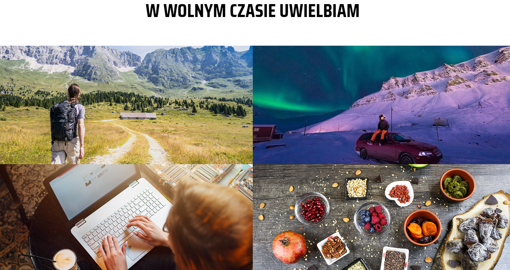
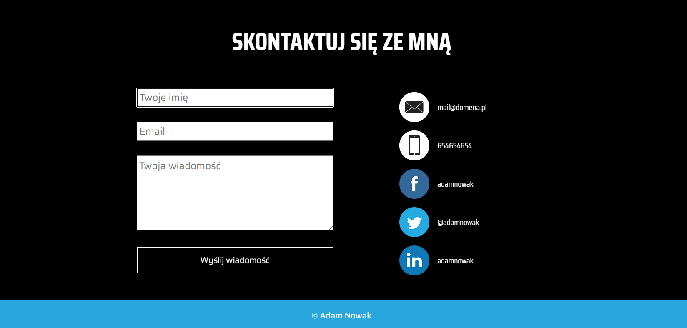

# Business card page

The website is one of my first projects. It can be used as a business card page presenting a person's portfolio, interests and contact details.

Technologies used:

-   HTML
-   CSS

The website is fully responsive on both computer and smartphone screens. Images were taken from the web and I do not own them.

Brief overview:

[Link to the application](https://bartlomiej-fr.github.io/business-card-page/)
